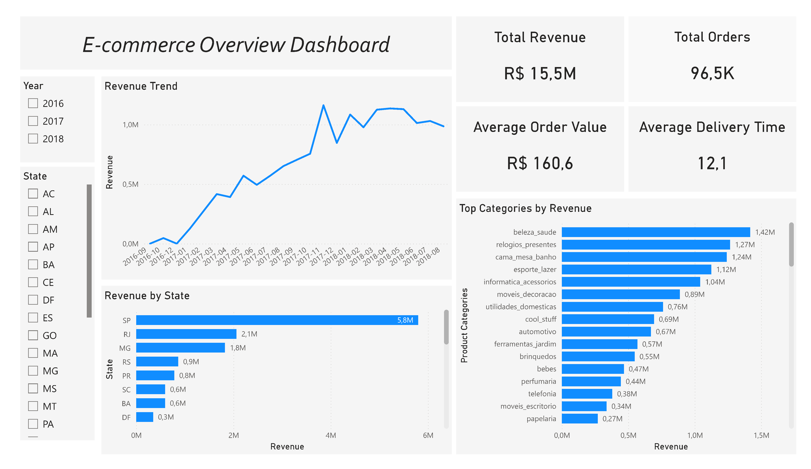
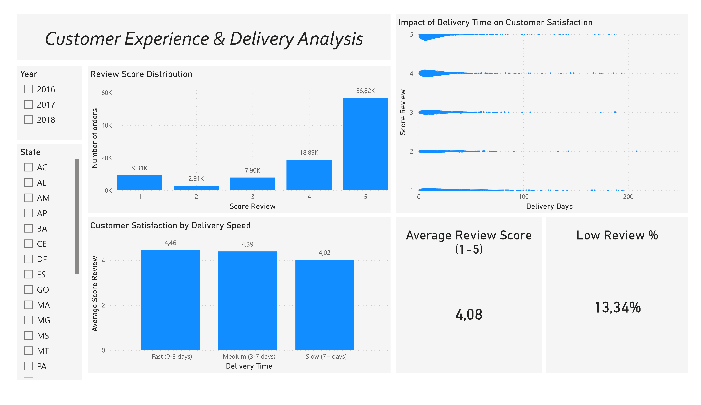

# 🚀 E-commerce Analytics Dashboard (Power BI)

## 📊 Project Overview

This project presents an end-to-end data analysis workflow for an e-commerce dataset, focusing on business performance and customer experience.

The goal was to analyse revenue trends, product performance, and the impact of delivery time on customer satisfaction using SQL and Power BI.

---

## 🛠️ Tech Stack

- SQL (SQLite) – data extraction and transformation  
- Power BI – dashboard development and visualisation  
- Python (optional) – data preprocessing  

---

## 📁 Data Preparation

Data from multiple tables was joined and transformed using SQL to create analytical datasets:

- `orders_analytics` – order-level data (revenue, delivery time, reviews)
- `order_items_analytics` – item-level data (product categories, pricing)

The processed datasets were exported to CSV and used in Power BI.

---

## 📊 Dashboard

### 🔹 Overview Page

Key features:
- Revenue trends over time  
- Top product categories by revenue  
- Revenue distribution by region  
- KPI metrics (Total Revenue, Orders, AOV, Delivery Time)

---

### 🔹 Customer & Delivery Analysis

Key features:
- Review score distribution  
- Relationship between delivery time and customer satisfaction  
- Customer satisfaction by delivery speed  
- KPI metrics (Average Review Score, Low Review %)

---

## 🔍 Key Insights

- Revenue shows a strong upward trend over time  
- A small number of product categories generate most of the revenue  
- Revenue is highly concentrated in specific regions (e.g. São Paulo)  
- Customer satisfaction is strongly influenced by delivery time  
- Faster deliveries result in significantly higher review scores  

---

## 💡 Business Recommendations

- Optimise delivery processes to reduce shipping time  
- Focus on high-performing product categories  
- Improve logistics in regions with slower delivery times  
- Monitor customer satisfaction metrics to detect issues early  

---

## 📂 Repository Structure
- data/ → processed datasets used in Power BI
- sql/ → SQL queries for data preparation
- dashboard/ → Power BI (.pbix) file
- images/ → dashboard screenshots

---

## 🎯 Project Purpose

This project was created as part of a data analytics portfolio to demonstrate:

- SQL data transformation skills  
- Data modelling and feature engineering  
- Dashboard design and storytelling  
- Business insight generation

---

## ▶️ How to Use

1. Download the `.pbix` file from the `dashboard/` folder
2. Open it in Power BI Desktop
3. Use filters (Year, State) to explore the data

---

## 📦 Data Source

Dataset: Brazilian E-Commerce Public Dataset (Olist)
